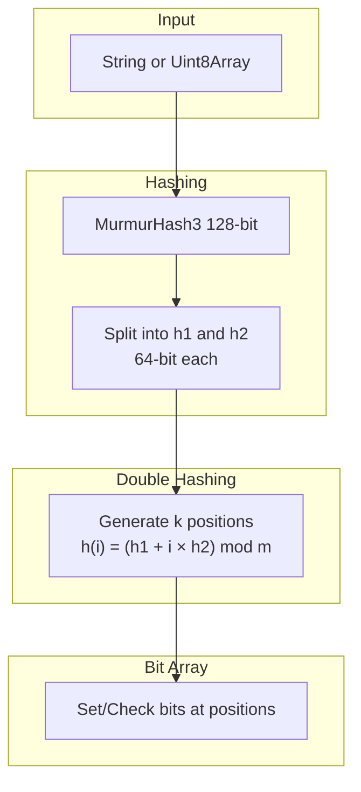
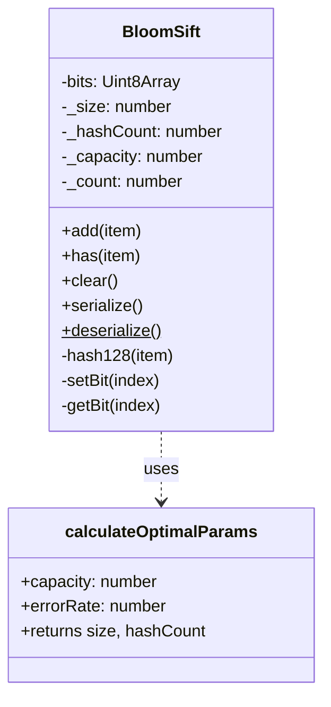
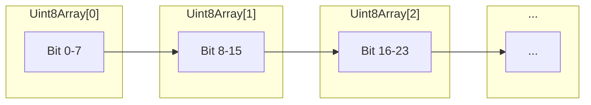

# Implementing a Fast Bloom Filter with Double Hashing

## The Problem

Applications frequently need to answer a simple question: "Have I seen this item before?" This arises in duplicate detection, cache optimization, database query filtering, and network packet deduplication.

The naive approach—storing every item in a hash set—works until you hit memory constraints. A set of 10 million URLs consumes roughly 500MB of memory. Scale to billions of items and the approach becomes impractical.

Bloom filters solve this by trading certainty for space. They answer "probably yes" or "definitely no" using a fraction of the memory. A Bloom filter for 10 million items with a 1% false positive rate requires only 12MB.

The catch: traditional implementations need multiple hash functions, which means multiple hash calls per operation. This is where bloom-sift improves on the standard approach.

## Why Another Bloom Filter Library?

Most Bloom filter implementations fall into two categories:

1. **Multiple hash functions** — Call k different hash functions per operation. Slow.
2. **Weak hash combinations** — Derive k values from one hash using simple arithmetic. Fast but poor bit distribution.

bloom-sift uses the Kirsch-Mitzenmacher optimization: a single 128-bit MurmurHash3 call provides two 64-bit values that generate all k hash positions with the same theoretical guarantees as k independent hashes.

The result: one hash call, proper distribution, same false positive rate.

## Architecture

### Data Flow



### Component Structure



### Memory Layout

The bit array is stored as a `Uint8Array` where each byte holds 8 bits:



For a filter with m bits, the array size is `ceil(m / 8)` bytes.

## Key Design Decisions

### 1. Optimal Parameter Calculation

Given expected capacity n and desired false positive rate p, the optimal parameters are:

- **Bit array size**: m = -n × ln(p) / (ln(2)²)
- **Hash function count**: k = (m/n) × ln(2)

```typescript
export function calculateOptimalParams(
  capacity: number,
  errorRate: number
): { size: number; hashCount: number } {
  const size = Math.ceil(
    (-capacity * Math.log(errorRate)) / (Math.LN2 * Math.LN2)
  );
  const hashCount = Math.round((size / capacity) * Math.LN2);
  return { size, hashCount };
}
```

For 1000 items at 1% error rate: m = 9586 bits, k = 7 hash functions.

### 2. Double Hashing with BigInt

The 128-bit hash is split into two 64-bit values using BigInt arithmetic:

```typescript
private hash128(item: string | Uint8Array): [bigint, bigint] {
  const hash = hash128x64(item, { output: 'bigint' }) as bigint;
  const mask64 = (1n << 64n) - 1n;
  const h1 = hash >> 64n;
  const h2 = hash & mask64;
  return [h1, h2];
}
```

Each bit position i is computed as: `(h1 + i × h2) mod m`

This maintains uniform distribution across the bit array without additional hash calls.

### 3. Browser Compatibility

Serialization uses `btoa`/`atob` instead of Node.js Buffer for universal browser support:

```typescript
serialize(): SerializedBloomSift {
  const binaryString = Array.from(this.bits, (byte) =>
    String.fromCharCode(byte)
  ).join('');
  const bits = btoa(binaryString);

  return { bits, size: this._size, hashCount: this._hashCount, count: this._count };
}
```

### 4. Deserialization Validation

The deserialize method validates all inputs to prevent corruption or injection:

```typescript
static deserialize(data: SerializedBloomSift): BloomSift {
  if (!data || typeof data.bits !== 'string') {
    throw new Error('Invalid serialized data: missing bits');
  }
  if (data.size <= 0 || !Number.isInteger(data.size)) {
    throw new Error('Invalid serialized data: size must be a positive integer');
  }
  // ... additional validation

  const expectedBytes = Math.ceil(data.size / 8);
  if (bits.length !== expectedBytes) {
    throw new Error(`Invalid serialized data: expected ${expectedBytes} bytes`);
  }
}
```

## Usage Examples

### Basic Usage

```typescript
import { BloomSift } from 'bloom-sift';

const filter = new BloomSift({ capacity: 10000, errorRate: 0.01 });

// Add items
filter.add('user:12345');
filter.add('user:67890');

// Check membership
filter.has('user:12345');  // true
filter.has('user:99999');  // false (probably)
```

### Persistence

```typescript
// Save to storage
const serialized = filter.serialize();
localStorage.setItem('seen-urls', JSON.stringify(serialized));

// Restore later
const data = JSON.parse(localStorage.getItem('seen-urls'));
const restored = BloomSift.deserialize(data);
restored.has('user:12345');  // true
```

### Pre-calculating Parameters

```typescript
import { calculateOptimalParams } from 'bloom-sift';

// Plan capacity requirements
const { size, hashCount } = calculateOptimalParams(1_000_000, 0.001);
// size: 14,377,588 bits (~1.7 MB)
// hashCount: 10

const memoryMB = (size / 8) / (1024 * 1024);
console.log(`Filter will use ${memoryMB.toFixed(2)} MB`);
```

### Monitoring Saturation

```typescript
const filter = new BloomSift({ capacity: 1000, errorRate: 0.01 });

for (let i = 0; i < 800; i++) {
  filter.add(`item-${i}`);
}

console.log(filter.fillRatio);  // 0.8 (80% of capacity)
// Consider creating a new filter when approaching 1.0
```

## Performance Characteristics

Tested on Apple M1 Pro:

| Operation | Throughput |
|-----------|------------|
| add()     | ~220,000 ops/sec |
| has()     | ~250,000 ops/sec |
| serialize() | ~50,000 ops/sec (10K items) |

Time complexity is O(k) for both add and has operations, where k is the number of hash functions (typically 7-15). Space complexity is O(m) where m is the bit array size.

### Memory Comparison

For 1 million items:

| Approach | Memory |
|----------|--------|
| JavaScript Set | ~50 MB |
| Bloom filter (1% FP) | ~1.2 MB |
| Bloom filter (0.1% FP) | ~1.8 MB |

## Real-World Applications

### 1. URL Deduplication in Web Crawlers

```typescript
const seen = new BloomSift({ capacity: 10_000_000, errorRate: 0.001 });

function shouldCrawl(url: string): boolean {
  if (seen.has(url)) {
    return false;  // Already crawled (probably)
  }
  seen.add(url);
  return true;
}
```

The 0.1% false positive rate means 1 in 1000 URLs might be skipped incorrectly—acceptable for most crawlers.

### 2. Cache Existence Check

```typescript
const cacheFilter = new BloomSift({ capacity: 100_000, errorRate: 0.01 });

async function get(key: string): Promise<Value | null> {
  // Skip expensive cache lookup if definitely not present
  if (!cacheFilter.has(key)) {
    return null;
  }
  // Might be a false positive, but worth checking
  return await expensiveCacheLookup(key);
}
```

### 3. Database Query Optimization

```typescript
// Pre-filter queries to avoid hitting the database
const userFilter = new BloomSift({ capacity: 1_000_000, errorRate: 0.01 });

// Populate from database on startup
for (const userId of existingUserIds) {
  userFilter.add(userId);
}

function userMightExist(userId: string): boolean {
  return userFilter.has(userId);
}
```

### 4. Spell Checker Dictionary

```typescript
const dictionary = new BloomSift({ capacity: 200_000, errorRate: 0.001 });

// Load dictionary words
words.forEach(word => dictionary.add(word.toLowerCase()));

function mightBeWord(input: string): boolean {
  return dictionary.has(input.toLowerCase());
}
```

## When to Use This Library

**Use bloom-sift when:**
- You need to test set membership with limited memory
- False positives are acceptable but false negatives are not
- The dataset is too large for a hash set
- You need fast O(k) lookups

**Don't use bloom-sift when:**
- You need to delete items (use counting Bloom filters)
- You need exact set operations (union, intersection with no false positives)
- False positives are unacceptable
- The capacity is highly unpredictable

## Trade-offs

| Factor | Bloom Filter | Hash Set |
|--------|--------------|----------|
| Memory | O(m) bits | O(n) objects |
| False positives | Yes (configurable) | No |
| False negatives | No | No |
| Deletions | No | Yes |
| Persistence size | Small | Large |

## Conclusion

bloom-sift provides a practical Bloom filter implementation that balances speed, accuracy, and simplicity. The Kirsch-Mitzenmacher optimization delivers the theoretical guarantees of multiple independent hash functions with a single hash call.

For applications where memory efficiency matters more than perfect accuracy—crawlers, caches, pre-filters—this trade-off is worthwhile. The library handles parameter calculation automatically, works in both Node.js and browsers, and provides serialization for persistence.

The code is straightforward to audit: one class, 220 lines, no complex dependencies beyond the hash function. That's the point—Bloom filters are a well-understood data structure, and the implementation should reflect that simplicity.
